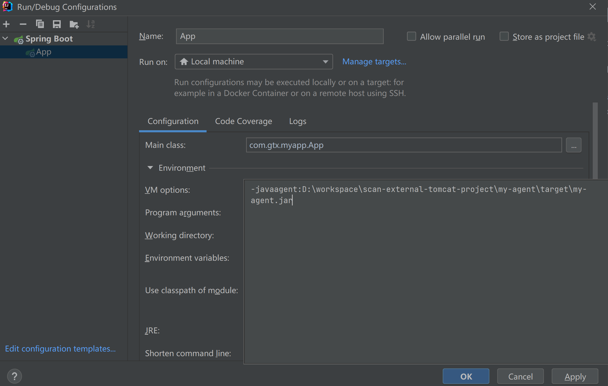
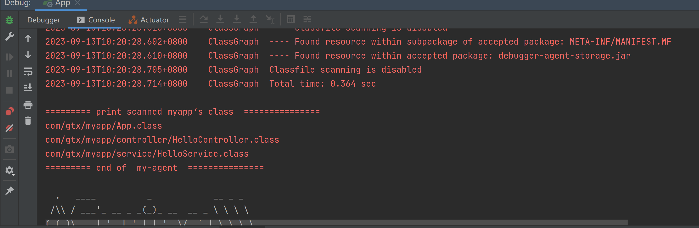

# scan-external-tomcat-project

this project has 2 branch: 
 - master: use spring-boot and built-in Tomcat server 
 - `external-tomcat`: use spring-boot and external Tomcat server

when run the app with my-agent on the master branch,the app's class can be scan out: \

but when i user external-tomcat with my-agent to run app, no app's class found: \