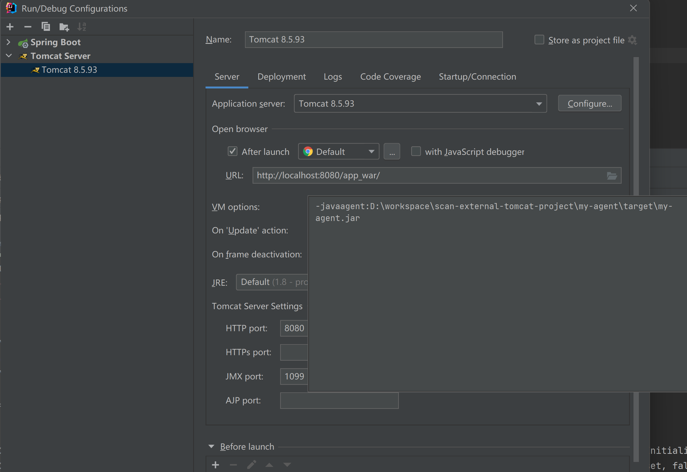

# scan-external-tomcat-project

## this project has 2 branch: 
 - `main`: use spring-boot and built-in Tomcat server 
 - `external-tomcat`: use spring-boot and external Tomcat server

## when run the app with my-agent on the master branch,the app's class can be scan out: 

## but when i user external-tomcat with my-agent to run app, no app's class found: 

## eclipse + tomcat
when i use eclipse-2023-09,i can't find servers and tomcat reference, if you have the
same problem you can follow me to change the settings

### step1 click help -> Install New Software
### step2 Choose the same site as our eclipse version

### step3 expand `Web,XML,Java EE and OSGi Enterprise Development` and choose `JST Server AdaptersExtensions`
### step4 click windows -> Preferences
### step5 click server -> Runtime Environments -> Add

### step6 set tomcat installation directory

